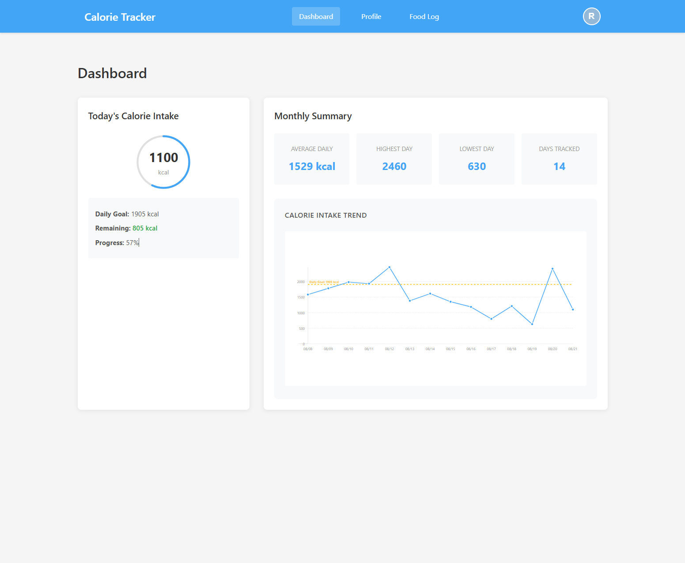
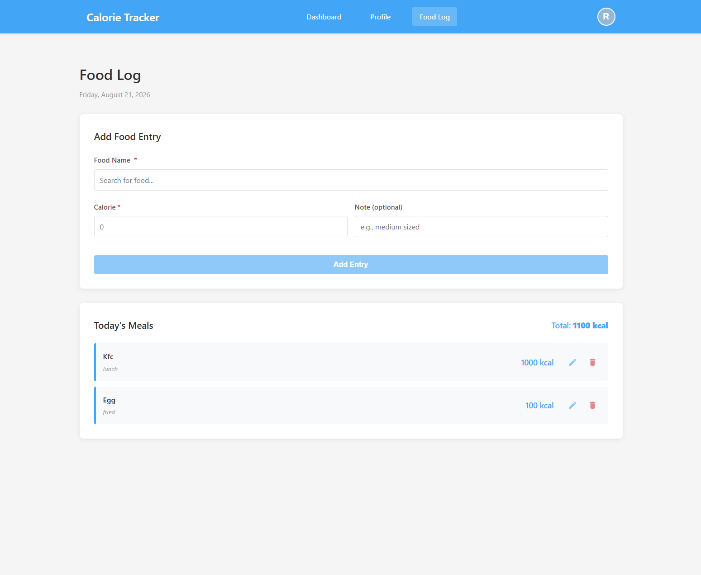
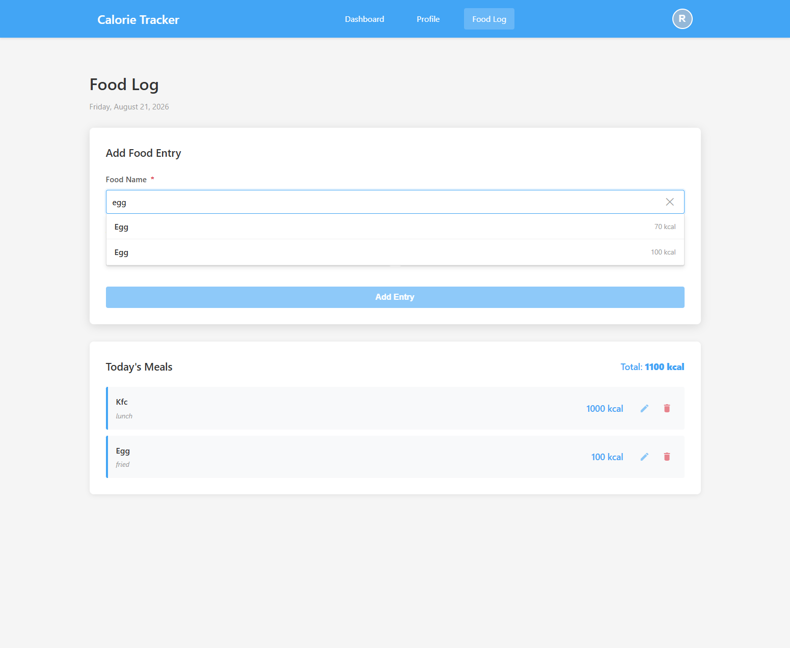
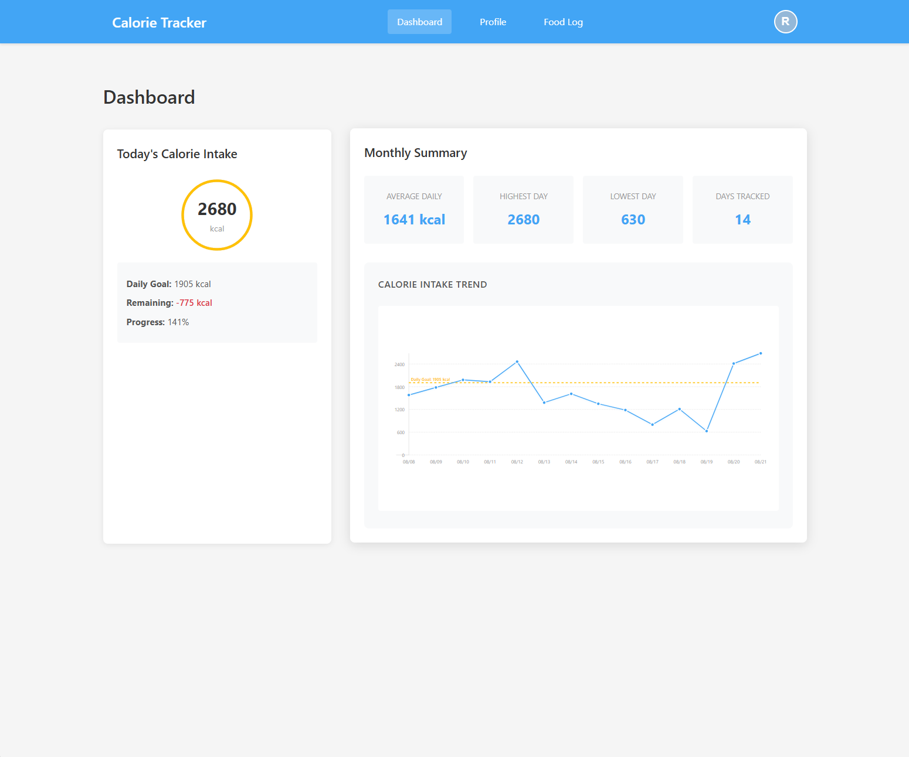
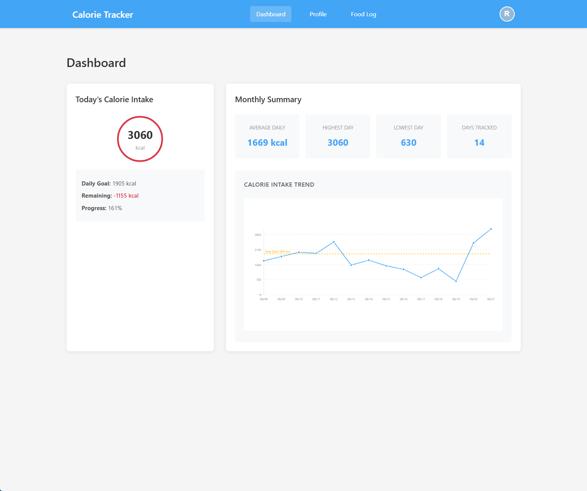
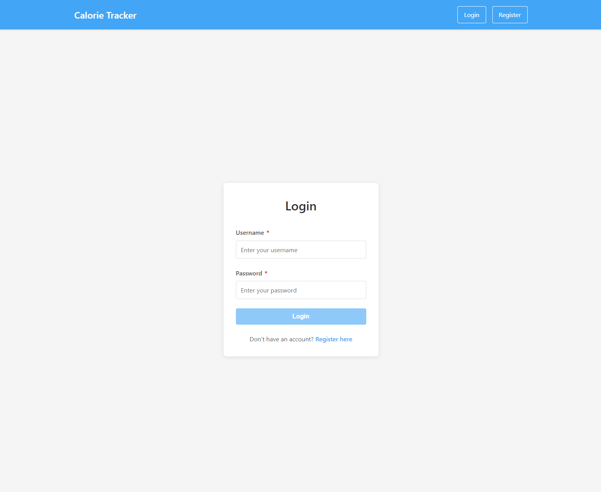
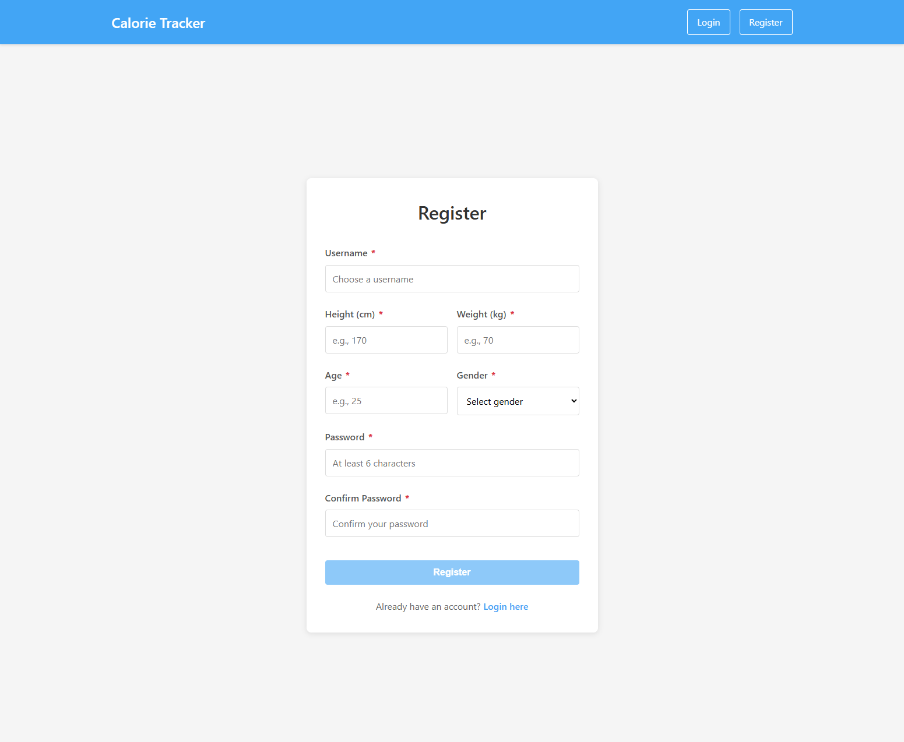
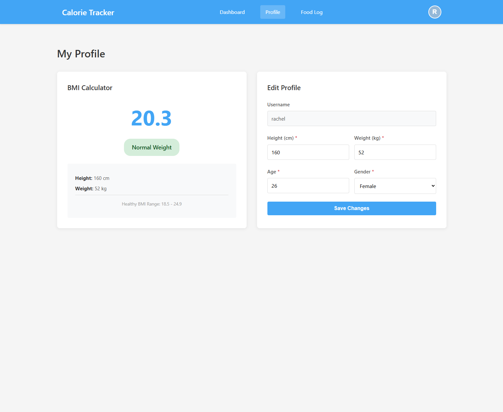
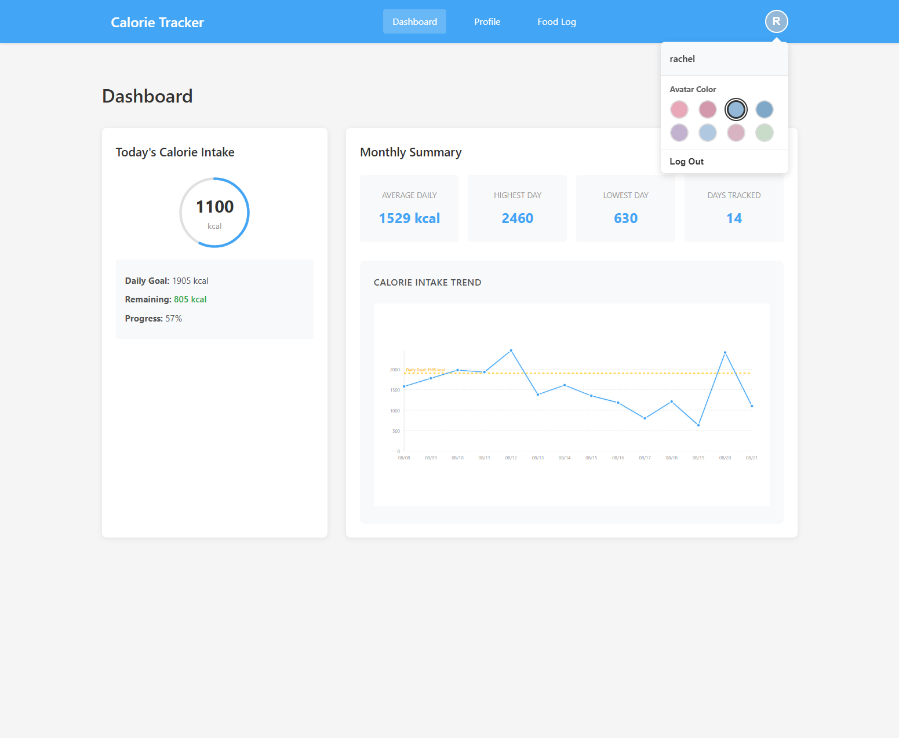

# Calorie Tracker

Full-stack calorie tracking application. Users log daily food intake, track
consumption against a calculated daily goal, and view progress on a dashboard.

- **Frontend:** Angular 18, TypeScript 5.5, RxJS 7.8
- **Backend:** Spring Boot 4.1, Java 17, Spring Security with JWT
- **Database:** MongoDB Community

---

## Screenshots

### Core Pages
- **Dashboard**: Real‑time calorie progress circular indicator, shows consumed / remaining calories and trend chart


- **Food Log**: Add and view daily food entries


- **Food Suggestion**: Real-time case-insensitive fuzzy search against a shared global `Foods` catalogue. Matches food names dynamically without personalized frequency ranking.


### Over‑consumption UI states
- High daily intake (100‑149% target): yellow progress ring


- Very high daily intake (>=150% target): red warning progress ring


### Auth & Profile
- Login Page


- Register Page


- User Profile page, update personal physical metrics and BMI info


- Profile avatar - selectable from the account menu in the header


---

## Table of contents

- [Technology stack](#technology-stack)
- [Prerequisites](#prerequisites)
- [Environment variables](#environment-variables)
- [Project structure](#project-structure)
- [Quick start](#quick-start)
- [Configuration](#configuration)
- [Database setup](#database-setup)
- [API reference](#api-reference)
- [Features](#features)
- [Architecture](#architecture)
- [Testing](#testing)
- [Accessibility](#accessibility)
- [Troubleshooting](#troubleshooting)
- [Command reference](#command-reference)
- [Known limitations](#known-limitations)
- [Roadmap](#roadmap)

---

## Technology stack

### Frontend

| Component | Version | Notes |
|---|---|---|
| Angular | 18 | NgModule-based, not standalone components |
| TypeScript | 5.5 | `strict` and `strictTemplates` enabled |
| RxJS | 7.8 | |
| Angular CDK | 18 | `A11yModule` for dialog focus management |
| Angular Material | 18 | `MatIconModule` only |

### Backend

| Component | Version | Notes |
|---|---|---|
| Java | 17 | Spring Boot 4 baseline |
| Spring Boot | 4.1.0 | Jackson 3 is the default JSON library |
| Spring Security | 7 (via Boot 4) | Stateless, JWT |
| Spring Data MongoDB | via Boot 4 | |
| jjwt | 0.12.6 | |
| Maven | 3.8+ | |

### Database

MongoDB Community Server, run locally on the default port 27017.

---

## Prerequisites

```bash
java -version     # 17 or later
node --version    # 18 or later
npm --version     # 9 or later
mvn --version     # 3.8 or later
```

Install MongoDB Community:

- **macOS:** `brew install mongodb-community`
- **Windows:** install MongoDB Community and keep *Install MongoDB as a Service*
  checked. That registers it as a background Windows service.

Install the Angular CLI:

```bash
npm install -g @angular/cli@18
```

**You must also set `JWT_SECRET` before starting the backend.** It has no default
value, so the application fails fast on startup rather than running with a
predictable signing key. See [Environment variables](#environment-variables).

---

## Environment variables

| Variable | Required | Default | Purpose |
|---|---|---|---|
| `JWT_SECRET` | **Yes**, except under the `dev` profile | none | HMAC signing key. Must be at least 32 bytes |
| `JWT_EXPIRATION` | No | `86400000` | Token lifetime in milliseconds (24 hours) |
| `MONGODB_URI` | No | `mongodb://localhost:27017` | Connection string, without a database name |
| `MONGODB_DATABASE` | No | `calorie_tracker` | Database name |
| `SERVER_PORT` | No | `8080` | |
| `SPRING_PROFILES_ACTIVE` | No | `dev` | `dev` or `prod` |
| `CORS_ALLOWED_ORIGINS` | No | empty | Comma-separated origins. Empty in production, which is served same-origin |

Generate a secret:

```bash
export JWT_SECRET="$(openssl rand -base64 48)"
```

The `dev` profile supplies a local development secret, so no environment
variable is needed for local work. Any other profile requires one.

---

## Project structure

```text
calorie-tracker/
├── backend/
│   ├── src/
│   │   ├── main/
│   │   │   ├── java/com/calorie/
│   │   │   │   ├── config/       # SecurityConfig, CorsConfig
│   │   │   │   ├── controller/   # REST controllers
│   │   │   │   ├── dto/          # request and response payloads
│   │   │   │   ├── exception/    # domain exceptions, GlobalExceptionHandler
│   │   │   │   ├── model/        # MongoDB documents
│   │   │   │   ├── repository/   # Spring Data repositories
│   │   │   │   ├── security/     # JWT provider, filter, entry points
│   │   │   │   ├── service/      # business logic
│   │   │   │   └── util/         # DateTimeUtil
│   │   │   └── resources/
│   │   │       ├── application.yml
│   │   │       ├── application-dev.yml
│   │   │       └── application-prod.yml
│   │   └── test/
│   │       ├── java/com/calorie/
│   │       └── resources/application.yml
│   └── pom.xml
└── frontend/
    ├── src/
    │   ├── app/
    │   │   ├── pages/
    │   │   │   ├── auth/         # login, register
    │   │   │   ├── dashboard/
    │   │   │   ├── food-log/
    │   │   │   └── profile/
    │   │   ├── shared/
    │   │   │   ├── components/   # header, modals, modal shell, notifications
    │   │   │   ├── guards/       # authGuard, publicGuard
    │   │   │   ├── interceptors/ # JwtInterceptor, ErrorInterceptor
    │   │   │   ├── models/
    │   │   │   ├── pipes/
    │   │   │   ├── services/
    │   │   │   └── utils/        # date.util.ts
    │   │   ├── app-routing.module.ts
    │   │   └── app.module.ts
    │   ├── environments/
    │   ├── index.html
    │   ├── main.ts
    │   └── styles.css            # design tokens and shared component styles
    ├── angular.json
    ├── karma.conf.js
    └── package.json
```

---

## Quick-Start

### 1. Start MongoDB

**macOS**

```bash
brew services start mongodb-community
mongosh --eval "db.adminCommand('ping')"
```

**Windows** — either open `services.msc`, find the MongoDB service and start it,
or from an Administrator terminal:

```powershell
net start MongoDB
```

Then verify from a normal terminal:

```bash
mongosh --eval "db.adminCommand('ping')"
```

A response containing `ok: 1` means MongoDB is listening on port 27017.

### 2. Start the backend

```bash
cd backend
export JWT_SECRET="$(openssl rand -base64 48)"   # optional under the dev profile
mvn spring-boot:run
```

The API is served at `http://localhost:8080/api`.

### 3. Start the frontend

```bash
cd frontend
npm install        # first run only
npm start
```

The application is available at `http://localhost:4200`.

---

## Configuration

### Backend

`backend/src/main/resources/application.yml`:

```yaml
spring:
  application:
    name: calorie-tracker-backend
  profiles:
    active: ${SPRING_PROFILES_ACTIVE:dev}
  data:
    mongodb:
      uri: ${MONGODB_URI:mongodb://localhost:27017}
      database: ${MONGODB_DATABASE:calorie_tracker}
      # Spring Boot 3+ defaults this to false, which silently disables every
      # @Indexed and @CompoundIndex declaration in com.calorie.model.
      auto-index-creation: true

server:
  port: ${SERVER_PORT:8080}
  servlet:
    # Left at root. The /api prefix comes from @RequestMapping on the
    # controllers; setting it here would produce /api/api/... paths.
    context-path: /

app:
  jwt:
    # No default, so startup fails when JWT_SECRET is absent.
    secret: ${JWT_SECRET}
    expiration: ${JWT_EXPIRATION:86400000}
  cors:
    allowed-origins: ${CORS_ALLOWED_ORIGINS:}
```

The `dev` profile adds a local signing key and permits
`http://localhost:4200`. The `prod` profile inherits the secret from the
environment and allows no cross-origin requests, since the frontend is served
same-origin behind a reverse proxy.

### Frontend

`frontend/src/environments/environment.ts`:

```typescript
export const environment = {
  production: false,
  apiBaseUrl: 'http://localhost:8080/api',
  jwtTokenKey: 'authToken',
};
```

`environment.prod.ts` uses a relative `apiBaseUrl` of `/api`, so the built
application requires a reverse proxy forwarding `/api` to the backend.

---

## Database setup

Collections are created on first write. Indexes are created at startup because
`auto-index-creation` is enabled.

### One-time step for existing databases

If the database predates the TTL index on the `foods` collection, drop the old
plain index once. MongoDB will not convert an existing index to a TTL index in
place:

```javascript
db.foods.dropIndex("expireAt_1")
```

### Verifying indexes

```javascript
db.account.getIndexes()    // username_1, unique
db.user.getIndexes()       // username_1, unique
db.foodlogs.getIndexes()   // username_date_index, unique
db.foods.getIndexes()      // name_calorie_index unique; expireAt_1 with expireAfterSeconds: 0
```

If a collection shows only `_id_`, index creation did not run — check
`auto-index-creation`. If a build fails at startup, the collection already
contains rows that violate the constraint and needs cleaning first.

### Collections

| Collection | Contents | Notes |
|---|---|---|
| `account` | Username and BCrypt password hash | Credentials only |
| `user` | Height, weight, age, gender | Profile only, no credentials |
| `foodlogs` | One document per user per day, entries embedded | Unique on username plus date |
| `foods` | Shared food catalogue | TTL removes entries 30 days after last use |

Credentials and profile are deliberately separate so authentication code never
loads profile data.

### Stopping MongoDB

```bash
brew services stop mongodb-community
```

---

## API reference

All paths are relative to `http://localhost:8080/api`. Every endpoint except
registration, login and health requires an `Authorization: Bearer <token>`
header.

Errors share one envelope:

```json
{
  "status": "error",
  "code": 400,
  "message": "Validation failed",
  "errors": { "height": "Height is required" },
  "timestamp": "2026-08-30T14:22:01.123"
}
```

`errors` is present only for validation failures.

### Authentication

```http
POST /api/auth/register
```

```json
{
  "username": "testuser",
  "password": "password123",
  "height": 160,
  "weight": 52,
  "age": 26,
  "gender": "female"
}
```

Returns `201 Created` with a token. Constraints: username 3–30 characters of
letters, digits, dot, underscore or hyphen; password 8–72 characters; height
50–300 cm; weight 20–500 kg; age 13–120; gender one of `male`, `female`,
`other`. Registration does **not** log the user in — the client discards the
token and redirects to login.

```http
POST /api/auth/login
```

```json
{ "username": "testuser", "password": "password123" }
```

Returns `200 OK`:

```json
{ "token": "<jwt>", "username": "testuser", "expiresIn": 86400000 }
```

`expiresIn` is milliseconds. A failed login returns `401` with
`"Invalid username or password"` — the same message for an unknown username and
a wrong password, so the endpoint cannot be used to enumerate accounts.

```http
POST /api/auth/logout
```

Returns `204 No Content` and performs no server-side work. Tokens are stateless
and there is no denylist, so a token remains valid until it expires. The client
discards it locally. Retained for API completeness only.

### User profile

```http
GET /api/users/me
GET /api/users/{username}
PUT /api/users/{username}
GET /api/users/{username}/bmi
```

A request for another user's resource returns `403`. `goalCalories` is
computed server-side and ignored if supplied in a request body.

`PUT` accepts a partial payload; omitted fields are left unchanged:

```json
{ "height": 170, "currentWeight": 51, "age": 24, "gender": "female" }
```

`GET /{username}/bmi` returns `400` when the profile has no height or weight,
since the request is well-formed but the stored data cannot support the
calculation.

### Food catalogue

```http
GET /api/foods?search=chicken&limit=10
```

Case-insensitive substring match on the normalised lowercase name. `search`
accepts up to 120 characters and regex metacharacters are escaped, so input is
matched literally. `limit` is 1–50 and defaults to 10, and is applied by the
database rather than after loading results.

Catalogue entries hold a name and a calorie value only. Notes belong to food log
entries, not to the catalogue.

### Food log

```http
GET /api/foodlogs?date=2026-08-21
```

`date` is optional and defaults to today in `America/New_York`. Returns an empty
log rather than `404` when no entries exist, so the client always has a shape to
render. A malformed date returns `400`.

```http
POST /api/foodlogs
```

```json
{
  "foodName": "salmon",
  "calorie": 280,
  "note": "steamed",
  "date": "2026-08-21"
}
```

Returns `201` with the updated log. `note` is optional; `calorie` is required
and must be 0–10000. Adding an entry also refreshes the matching catalogue
entry's expiry, creating it if absent.

```http
PUT    /api/foodlogs/{foodLogId}/items/{itemId}
DELETE /api/foodlogs/{foodLogId}/items/{itemId}
```

`PUT` body:

```json
{ "foodName": "salmon", "calorie": 285, "note": "seasoned" }
```

Entries are addressed by a stable `id` assigned on creation, not by array
position — an index shifts when another session inserts or removes an entry, so
a queued edit could land on the wrong row. The update carries no date: the day
is derived from the stored document. Both endpoints verify the log belongs to
the authenticated user and return `403` otherwise, `404` for an unknown log or
entry.

### Dashboard

```http
GET /api/dashboard/today
```

```json
{
  "username": "testuser",
  "date": "2026-08-30",
  "calorieTracking": {
    "consumed": 900,
    "suggestedDaily": 1905,
    "remaining": 1005,
    "percentage": 47.24
  },
  "bmi": { "value": 20.3, "category": "Normal Weight" },
  "foodsLogged": 2
}
```

`bmi` is `null` when the profile has no height or weight, so an incomplete
profile degrades one panel rather than failing the request.

```http
GET /api/dashboard/monthly-stats?months=1
```

`months` is a **lookback count**, not a calendar month, and is bounded to 1–24.

```json
{
  "username": "testuser",
  "period": "2026-07-30 to 2026-08-30",
  "dailyData": [
    { "date": "2026-08-29", "totalCalories": 0 },
    { "date": "2026-08-30", "totalCalories": 2200 }
  ],
  "summary": {
    "averageDailyConsumption": 1333.33,
    "highestDay": "2026-08-30",
    "highestDayCalories": 2200,
    "lowestDay": "2026-08-29",
    "lowestDayCalories": 0,
    "daysWithLogs": 3,
    "totalLogged": 4000
  }
}
```

`dailyData` contains **one point per calendar day**, including untracked days,
because the chart plots by position — a sparse series made a two-week gap render
identically to consecutive days. `summary` is computed over logged days only:
including zero-filled days would drag the average toward zero and make the
reported minimum always zero.

`highestDay` and `lowestDay` are `null` when nothing was logged in the range.

### Health

```http
GET /api/health
GET /actuator/health
```

Both are unauthenticated.

### Status codes

| Code | Meaning |
|---|---|
| 400 | Validation failure, malformed date or body, unconvertible parameter |
| 401 | Missing, invalid or expired token; failed login |
| 403 | Authenticated but requesting another user's resource |
| 404 | Unknown user, food log or entry |
| 409 | Username already taken |
| 500 | Unexpected server error; details are logged, not returned |

401 and 403 are deliberately distinct. Without an explicit
`AuthenticationEntryPoint`, Spring Security returns 403 for an unauthenticated
request, which the client cannot distinguish from a genuine permission failure —
so an expired token would never trigger re-authentication.

---

## Features

- **JWT authentication** — registration, login, route guards, and a reactive
  current-user stream backing the header.
- **BMI and TDEE** — daily calorie goal from the user's own metrics.
- **Daily food logging** — add, edit and delete entries with a debounced
  catalogue search.
- **Dashboard** — daily progress ring and monthly intake trend.
- **Profile management** — update metrics and see BMI recalculate.
- **Shared food catalogue** — entries are created on first use and expire 30 days
  after they were last logged.

### Calorie formula

Mifflin-St Jeor, with a moderate activity factor:

```text
Male:   BMR = 10 × weight(kg) + 6.25 × height(cm) − 5 × age + 5
Female: BMR = 10 × weight(kg) + 6.25 × height(cm) − 5 × age − 161

TDEE = BMR × 1.55
```

The result is floored at 1200 kcal as a safety minimum. A gender of `other`, or
any incomplete metric, falls back to 2000 kcal.

### Timezone handling

Days are scoped to `America/New_York`, which handles the daylight-saving
transition automatically. Documents store UTC timestamps; a day is queried as
the UTC range spanning that local calendar day. All conversion lives in
`DateTimeUtil`.

---

## Architecture

```text
Angular (localhost:4200)
   │  JwtInterceptor attaches the Bearer token, skipping /auth/
   │  ErrorInterceptor is the single owner of HTTP error messaging
   ▼
Spring Boot (localhost:8080/api)
   │  JwtAuthenticationFilter populates the security context
   │  Controllers stay thin; the principal comes from Authentication
   │  Services hold business logic
   ▼
MongoDB (localhost:27017)
```

### Authentication flow

1. The user registers or logs in.
2. The backend verifies credentials against the BCrypt hash and returns a signed
   JWT.
3. `AuthService` stores the token and a lightweight `{ username }` record, then
   pushes it into a `BehaviorSubject`. Components read that stream through the
   async pipe. Persistence lives only in the service.
4. `JwtInterceptor` attaches the token to every request except `/auth/`.
5. `JwtAuthenticationFilter` validates the signature and expiry and populates the
   security context. It never rejects — an unauthenticated request falls through
   so a single entry point produces one consistent 401.
6. On a 401 from a non-auth endpoint, `ErrorInterceptor` clears local state and
   redirects to login. A 401 from login itself is reported as invalid
   credentials, without logging the user out.

### Frontend conventions

- Design tokens live in `src/styles.css`. Component stylesheets hold only what is
  unique to that component; shared `.card`, `.btn`, `.form-control` and keyframes
  are global.
- Dialogs use a single `ModalShellComponent` which owns focus trapping,
  `Escape` handling, focus restoration and dialog roles.
- Subscriptions use the async pipe where possible, and
  `takeUntil(destroy$)` where imperative work is needed in the handler.

---

## Testing

```bash
cd backend
mvn test

cd frontend
npm test              # single run, ChromeHeadless
```

`BackendApplicationTests` starts a Spring context, so **MongoDB must be
reachable** for `mvn test` to pass. Unit tests for services, controllers and
utilities use mocks and need no database.

Frontend tests run once under `ChromeHeadless`; `karma.conf.js` sets
`singleRun: true` and `autoWatch: false`.

### Coverage

| Area | Covered |
|---|---|
| Backend services | Auth, food log, user, dashboard, food |
| Backend controllers | Auth, food log, user, food via MockMvc standalone setup |
| Security | Token generation, validation, expiry, tampering, fail-fast config |
| Utilities | Timezone conversion including a daylight-saving case |
| Frontend components | Login, register, food log, dashboard chart maths |
| Frontend services | Notification lifecycle and timer cleanup |

Not covered: integration tests against a real MongoDB, so index behaviour is
unverified. Parameter-level constraints such as `@Min` on a `@RequestParam` are
not enforced by `standaloneSetup` and would need `@WebMvcTest`.

---

## Accessibility

- Every form control has a label, and errors are linked with `aria-describedby`
  and announced via `role="alert"`.
- Credential fields carry `autocomplete` so password managers work, and password
  fields have a visibility toggle exposing state through `aria-pressed`.
- The food search implements the combobox pattern: arrow keys move the
  highlight, `Enter` selects, `Escape` dismisses, and the active option is
  communicated with `aria-activedescendant` while focus stays in the input.
- Dialogs use `role="dialog"` or `role="alertdialog"`, trap focus, close on
  `Escape`, and restore focus to whatever opened them. Destructive
  confirmations focus the safe action.
- Toasts sit in a live region; errors are announced assertively.
- A single global `:focus-visible` outline provides a keyboard affordance.
- `prefers-reduced-motion` suppresses animation.

Full conformance requires manual testing with assistive technology and expert
review; the above describes what has been implemented, not a certified result.

---

## Troubleshooting

**Application fails to start with "app.jwt.secret is not configured"**

Expected behaviour when `JWT_SECRET` is unset outside the `dev` profile. Set it,
or run with `SPRING_PROFILES_ACTIVE=dev`.

**"app.jwt.secret must be at least 32 bytes"**

HS256 requires a 256-bit key. Generate one with
`openssl rand -base64 48`.

**Port 8080 in use**

```bash
lsof -i :8080
kill -9 <PID>
```

**Port 4200 in use**

```bash
ng serve --port 4201
```

**MongoDB connection refused**

```bash
brew services start mongodb-community
mongosh --eval "db.adminCommand('ping')"
```

**Every request returns 401 after working earlier**

The token expired. Log in again. If it happens immediately, confirm the backend
was not restarted with a different `JWT_SECRET` — tokens signed with the old key
no longer validate.

**Duplicate usernames appear, or two logs exist for one day**

The unique indexes are missing. Check `auto-index-creation` is `true` and inspect
`db.account.getIndexes()`.

**Food catalogue grows without bound**

The TTL index is missing or was created without `expireAfterSeconds`. Drop
`expireAt_1` and restart, then confirm with `db.foods.getIndexes()`.

**Frontend cannot reach the API**

Confirm the backend is on 8080, check `apiBaseUrl` in `environment.ts`, and
verify `CORS_ALLOWED_ORIGINS` includes `http://localhost:4200` — the `dev`
profile sets this already.

**Maven build fails after a dependency change**

```bash
cd backend
mvn clean install
```

---

## Command reference

```bash
# MongoDB
brew services start mongodb-community
brew services stop mongodb-community
mongosh --eval "db.adminCommand('ping')"

# Backend
cd backend
mvn spring-boot:run
mvn clean install
mvn test
SPRING_PROFILES_ACTIVE=prod mvn spring-boot:run

# Frontend
cd frontend
npm install
npm start
npm run build
npm test
ng lint
```

---

## Known limitations

Documented deliberately rather than left to be discovered.

| Limitation | Impact | Mitigation |
|---|---|---|
| Tokens in `localStorage` | Readable by any script, so XSS exposes them | `httpOnly` cookies plus a CSRF token; a coordinated change, not a patch |
| No login rate limiting | Brute-forceable | Rate limit keyed on username and IP |
| No token denylist | A stolen token stays valid until expiry | Short-lived access tokens with refresh, or a server-side denylist |
| `aria-modal` on a non-root dialog | Background stays in the accessibility tree for some assistive technology | Render via `@angular/cdk/overlay` |
| Dialog uses `position: fixed` | Breaks if an ancestor gains a `transform` | Same fix as above |
| No integration tests against MongoDB | Index behaviour is unverified | Testcontainers |
| `chart.js` and `ng2-charts` unused | Dependency surface for no benefit | Remove them, or adopt them and retire the hand-rolled SVG chart |
| Entry ids backfilled lazily on read | A GET can perform a write for legacy documents | A one-off migration keeps reads pure |
| Two-collection registration is not transactional | A failed profile write is compensated, and the compensation can itself fail | Multi-document transactions, which need a replica set |

---

## Roadmap

**Backend**

- Rate limiting on the authentication endpoints
- Integration tests with Testcontainers
- Refresh tokens with short-lived access tokens
- OpenAPI specification generated from the controllers

**Frontend**

- End-to-end tests covering the log-a-meal flow
- Move dialogs to the CDK overlay
- Decide on `chart.js` versus the hand-rolled SVG chart

**Documentation**

- Animated walkthrough of the core workflow
